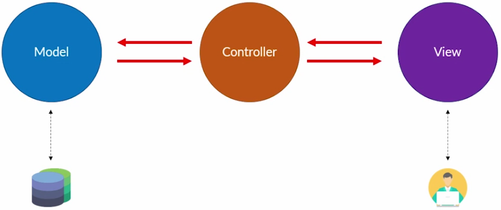
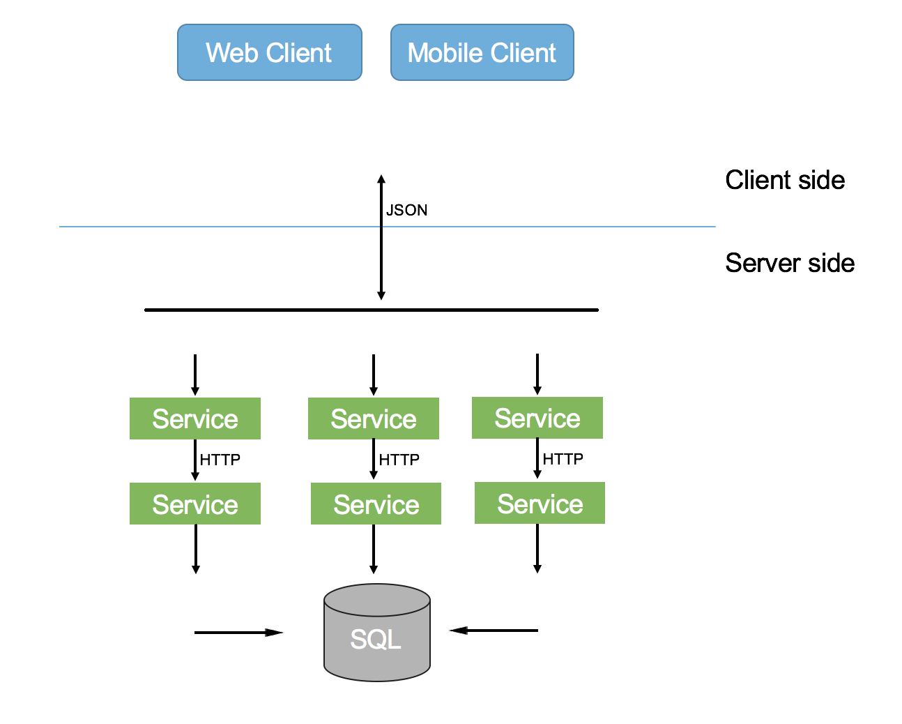
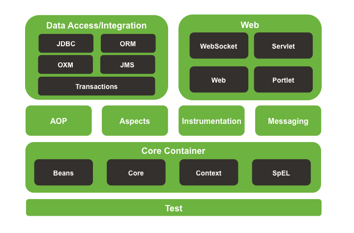
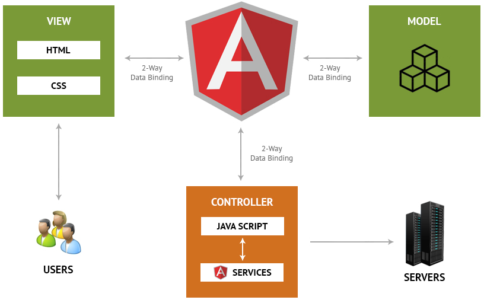
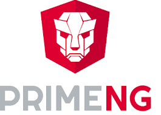
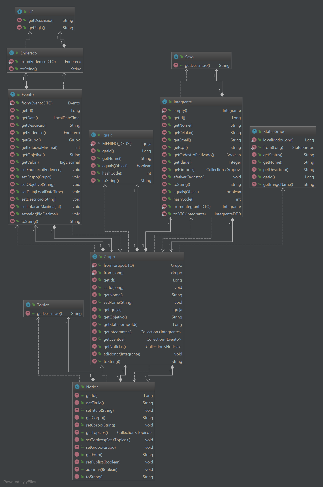
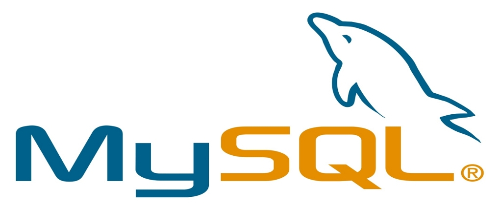

# Groups Manager #

# Documento de Arquitetura

## 1) Introdução

### 1.1 Finalidade

A finalidade deste artefato é apresentar a arquitetura escolhida para a construção da aplicação `Groups Manager`. 
Serão expostas as visões arquiteturais utilizadas, tendo como objetivo deixar de forma explícita as decisões 
estabelecidas.

## 2) Representação da Arquitetura

A arquitetura utilizada na aplicação é o padrão arquitetural Model-View-Controller (MVC), que é adotada nos frameworks Angular e Spring.

* Model - A camada model é responsável pela regras de negócio da aplicação e a as regras para manipulação de dados. ]
Esta representa as informações abstraídas do mundo real definindo como tais informações são armazenadas no banco de dados e 
suas relações desempenhadas.

* View - A camada view é a responsável por formatar as informações e apresentá-las ao usuário de forma organizada.

* Controller - A camada controller é responsável pelo fluxo do usuário na aplicação. Esta é usada para comunicação com a 
Model e renderização das Views, com informações procedentes da Model.

Figura 1. Diagrama do padrão MVC

O diagrama pode ser descrito da seguinte maneira:

* 1 - O usuário deseja acessar uma página da aplicação através do browser. O browser envia a solicitação ao servidor e, através do gerenciador de rotas, a solicitação é enviada à uma Controller.

* 2 - Caso a página que o usuário deseja observar tenha alguma informação que necessite ser puxada da base de dados, a Controller irá solicitar a uma Model.

* 3 - A Model solicitará as informações a base de dados.

* 4 - As informações são retornadas a Model. Nesse momento os dados são tratados de forma a seguir as regras de negócio da aplicação.

* 5 - A Model retorna as informações a Controller.

* 6 - A Controller envia as informações solicitadas para a View, para que estas sejam formatadas.

* 7 - A View formata as informações recebidas e retorna ao usuário.

## 3) Visão Lógica
A aplicação Groups Manager é construída sobre os frameworks Spring Boot e Angular utilizando as linguagens Java e Javascript. 
Estes frameworks utilizam a lógica MVC(Model-View-Controller), tal lógica permite a divisão da estrutura da ferramenta web em 3 blocos sólidos que comunicam-se entre si: View, controller, model.

### 3.1 Tecnologias Utilizadas

Figura 1. Diagrama de estrutura da aplicacao Groups Manager

O diagrama pode ser descrito da seguinte maneira:

* 1 - Tem-se uma aplicacao que consumira os servicos atraves de requisicoes `HTTP`, no formato de `JSON`

* 2 - Tem-se uma aplicacao que recebe estas requisicoes `HTTP`, onde fara o processamento das requisicao, podendo acessar o banco de dados. 
Finalizando com uma resposta no forma de `JSON`.

A Aplicação Groups Manager foi divida em dois Projetos:

### ``groups-manager``

* ``groups-manager`` sera o projeto `backend` que disponibilizara os servicos a serem consumidos no projeto `frontend`.
o projeto ``groups-manager`` utilizara o `java` como linguagem de alto nivel.
Sendo utilizado os seguintes frameworks para a ajudar no desenvolvimento dos servicos a serem disponibilizados:

* Hibernate/JPA - Framerwok ORM de abstracao das entidades do banco de dados para a aplicacao java

* H2 - Banco de dados em Memoria, sera utilizado para os testes da aplicacao

* Spring Framework - sera utilizado varios modulos da plataforma Spring, tais como: 
Spring Data, para abstracao de acesso aos dados do banco de dados, 
Spring MVC, para disponibilizacao dos servicos WEB
Spring Boot, para a integracao dos modulos do Spring de uma forma mais produtiva, sendo muito facil utilizar os modulos do spring sem muita configurao

Figura 1. Ecossistema Spring

### ``groups-manager-ui``

* ``groups-manager-ui`` sera o projeto `frontend` que consumira os servicos a disponibilizados pelo `backend`.
o projeto ``groups-manager-ui`` utilizara `HTML5 e Javascrip` como linguagens de alto nivel.
Sendo utilizado os seguintes frameworks para a ajudar no desenvolvimento dos servicos a serem disponibilizados:

* Angular - É um framework que permite desenvolver aplicações web e mobile. com performance e rapidez, boa comunidade e documentação.
É um framework mantido pelo Google, sendo um dos frameworks frontend mais utilizado no mercado atualmente.

Figura 1. Ecossistema Angular

* PrimeNG - É um framework que disponibiliza varios componentes prontos e faceis de ser utilizados com o angular.

Figura 1. Logo PrimeNG

### 3.1 Diagrama de Classes

Figura 1. Diagrama de classes

### 3.2 Banco de dados

O projeto utiliza o sistema gerenciamento de banco de dados H2 para o ambiente de desenvolvimento. No ambiente de produção é utilizado outro sistema de banco de dados, o MySQL.

O MySQL foi adotado em ambiente de produção devido a facilidade de ser utilizado, liberdade Open Source.

Figura 1. Banco de dados MySQL