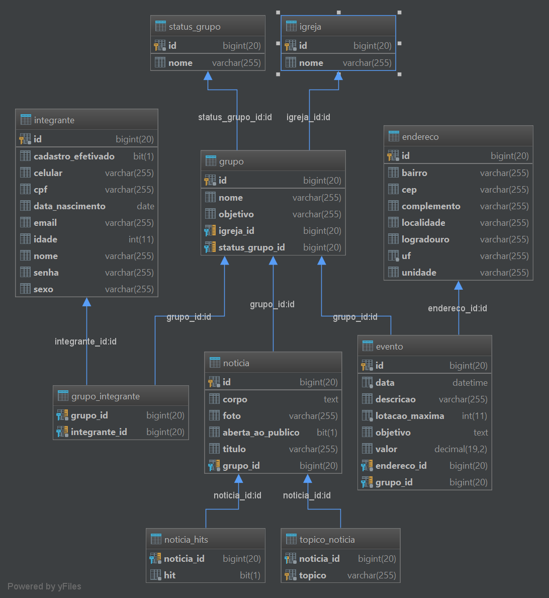

# Groups Manager #

# Estrutura M.E.R (Modelo de entidade relacional)

# Estrutura do banco

* Entidade Endereço

        CREATE TABLE `endereco` (
          `id` bigint(20) NOT NULL AUTO_INCREMENT,
          `bairro` varchar(255) DEFAULT NULL,
          `cep` varchar(255) DEFAULT NULL,
          `complemento` varchar(255) DEFAULT NULL,
          `localidade` varchar(255) DEFAULT NULL,
          `logradouro` varchar(255) DEFAULT NULL,
          `uf` varchar(255) NOT NULL,
          `unidade` varchar(255) DEFAULT NULL,
          PRIMARY KEY (`id`)
        ) ENGINE=InnoDB AUTO_INCREMENT=2 DEFAULT CHARSET=utf8;
        
* Entidade Igreja

        CREATE TABLE `igreja` (
          `id` bigint(20) NOT NULL,
          `nome` varchar(255) DEFAULT NULL,
          PRIMARY KEY (`id`)
        ) ENGINE=InnoDB DEFAULT CHARSET=utf8;        
        
* Entidade Status Grupo

        CREATE TABLE `status_grupo` (
          `id` bigint(20) NOT NULL,
          `descricao` varchar(255) DEFAULT NULL,
          `nome` varchar(255) DEFAULT NULL,
          `status` varchar(255) DEFAULT NULL,
          PRIMARY KEY (`id`)
        ) ENGINE=InnoDB DEFAULT CHARSET=utf8;
        
* Entidade Grupo

        CREATE TABLE `grupo` (
          `id` bigint(20) NOT NULL AUTO_INCREMENT,
          `igreja_id` bigint(20) NOT NULL,
          `nome` varchar(255) DEFAULT NULL,
          `objetivo` varchar(255) DEFAULT NULL,
          `status_grupo_id` bigint(20) NOT NULL,
          PRIMARY KEY (`id`),
          KEY `fk_grupo_igreja_id` (`igreja_id`),
          KEY `fk_grupo_status_grupo_id` (`status_grupo_id`),
          CONSTRAINT `fk_grupo_igreja_id` FOREIGN KEY (`igreja_id`) REFERENCES `igreja` (`id`),
          CONSTRAINT `fk_grupo_status_grupo_id` FOREIGN KEY (`status_grupo_id`) REFERENCES `status_grupo` (`id`)
        ) ENGINE=InnoDB AUTO_INCREMENT=19 DEFAULT CHARSET=utf8;        
        
* Entidade Integrante

        CREATE TABLE `integrante` (
          `id` bigint(20) NOT NULL AUTO_INCREMENT,
          `cadastro_efetivado` bit(1) DEFAULT NULL,
          `celular` varchar(255) DEFAULT NULL,
          `cpf` varchar(255) DEFAULT NULL,
          `data_nascimento` date DEFAULT NULL,
          `email` varchar(255) DEFAULT NULL,
          `idade` int(11) DEFAULT NULL,
          `nome` varchar(255) DEFAULT NULL,
          `senha` varchar(255) DEFAULT NULL,
          `sexo` varchar(255) DEFAULT NULL,
          PRIMARY KEY (`id`)
        ) ENGINE=InnoDB AUTO_INCREMENT=6 DEFAULT CHARSET=utf8;    
        
* Entidade Grupo Integrante

        CREATE TABLE `grupo_integrante` (
          `grupo_id` bigint(20) NOT NULL,
          `integrante_id` bigint(20) NOT NULL,
          KEY `fk_grupo_integrante_integrante_id` (`integrante_id`),
          KEY `fk_grupo_integrante_grupo_id` (`grupo_id`),
          CONSTRAINT `fk_grupo_integrante_grupo_id` FOREIGN KEY (`grupo_id`) REFERENCES `grupo` (`id`),
          CONSTRAINT `fk_grupo_integrante_integrante_id` FOREIGN KEY (`integrante_id`) REFERENCES `integrante` (`id`)
        ) ENGINE=InnoDB DEFAULT CHARSET=utf8;           
        
* Entidade Evento

        CREATE TABLE `evento` (
          `id` bigint(20) NOT NULL AUTO_INCREMENT,
          `data` datetime NOT NULL,
          `descricao` varchar(255) DEFAULT NULL,
          `lotacao_maxima` int(11) NOT NULL,
          `objetivo` text,
          `valor` decimal(19,2) DEFAULT NULL,
          `endereco_id` bigint(20) NOT NULL,
          `grupo_id` bigint(20) NOT NULL,
          PRIMARY KEY (`id`),
          KEY `fk_evento_endereco_id` (`endereco_id`),
          KEY `fk_evento_grupo_id` (`grupo_id`),
          CONSTRAINT `fk_evento_endereco_id` FOREIGN KEY (`endereco_id`) REFERENCES `endereco` (`id`),
          CONSTRAINT `fk_evento_grupo_id` FOREIGN KEY (`grupo_id`) REFERENCES `grupo` (`id`)
        ) ENGINE=InnoDB AUTO_INCREMENT=12 DEFAULT CHARSET=utf8;
                         
* Entidade Noticia

        CREATE TABLE `noticia` (
          `id` bigint(20) NOT NULL AUTO_INCREMENT,
          `corpo` text,
          `foto` varchar(255) DEFAULT NULL,
          `aberta_ao_publico` bit(1) DEFAULT NULL,
          `titulo` varchar(255) DEFAULT NULL,
          `grupo_id` bigint(20) NOT NULL,
          PRIMARY KEY (`id`),
          KEY `fk_noticia_grupo_id` (`grupo_id`),
          CONSTRAINT `fk_noticia_grupo_id` FOREIGN KEY (`grupo_id`) REFERENCES `grupo` (`id`)
        ) ENGINE=InnoDB AUTO_INCREMENT=19 DEFAULT CHARSET=utf8;
        
* Entidade Noticia Hits

        CREATE TABLE `noticia_hits` (
          `noticia_id` bigint(20) NOT NULL,
          `hit` bit(1) NOT NULL,
          KEY `fk_noticia_hits_noticia_id` (`noticia_id`),
          CONSTRAINT `fk_noticia_hits_noticia_id` FOREIGN KEY (`noticia_id`) REFERENCES `noticia` (`id`)
        ) ENGINE=InnoDB DEFAULT CHARSET=utf8;             
        
* Entidade Topico Noticia

        CREATE TABLE `topico_noticia` (
          `noticia_id` bigint(20) NOT NULL,
          `topico` varchar(255) NOT NULL,
          PRIMARY KEY (`noticia_id`,`topico`),
          CONSTRAINT `fk_topico_noticia_noticia_id` FOREIGN KEY (`noticia_id`) REFERENCES `noticia` (`id`)
        ) ENGINE=InnoDB DEFAULT CHARSET=utf8;                   